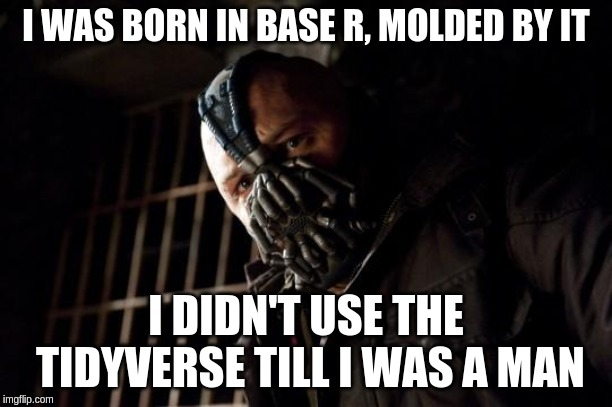
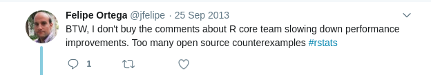
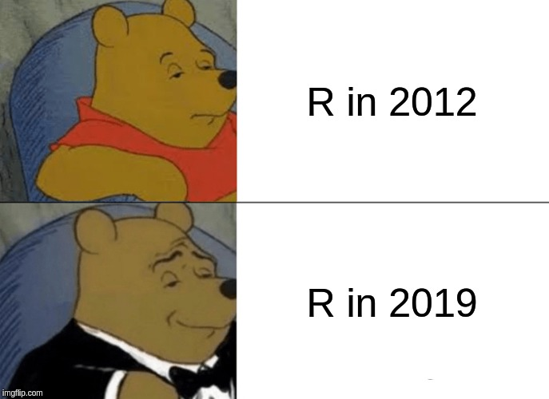

```{r setup, include=FALSE}
knitr::opts_chunk$set(echo = TRUE)
requireNamespace("tibble")
library(pryr)
library(tidyverse)
library(rlang)
```

## My Programming History

- 2010: Started programming. Began with C, but ran away from computers because it was hard.
- 2011: Started programming with R in 2011, realised it wasn't so bad. R became my daily driver and I used R instead of Matlab at university 
  - before the tidyverse
  - used knitr before R markdown (shell script escapes on pdflatex)
  - mostly tiny uni datasets, never ran into problems

## What tidyverse?



  
## My Programming History (2)
- 2013: Started programming in Python while at Cochlear. 
  - Started to run into performance issues with R. Sessions kept crashing and datasets started getting bigger.
  - Became a Bayesian - now I needed efficiency and started to program a lot more (BUGS anybody)
  - Started to switch to python a lot more. Fell in love with programming
- 2014: Returned to comp sci and became more confident with C, Java. Picked up some Haskell and CUDA too!
- 2015-2018: Working for HFT, mostly using Python and C++
- 2018: Used R for census and survey analysis (Parliament)
- 2019: Using Julia for Speech Recognition and Deep Learning.

## Informal Survey

- How many years have you been using R?
- How many languages can you program in besides R?
- Have you used S3 or S4 methods (or Reference classes or R6)?
- Do you consider yourself a user or a developer?
- Do you run your code with RScript or mostly interactive?

## What to Expect

 - Unnecessary History about R
 - Hadley's Advanced R without Hadley
 - Some Comp Sci theory and terms
 - Some cross language comparisons
 - Way too much information
 - Mostly useless but interesting
 - Watch me fumble to build a pipe in R

## TOC

1. Programming Languages
2. History of R
3. The R Language
  - Memory and Reference Counting
  - Lexical Scoping and Closures
  - Lazy Evaluation and basic meta-programming
4. Building a Pipe
5. Conclusion

# Programming Languages

## Programming Languages

  - **What is a programming language?**
    - R as a programming Language
    - Python as  Programming Language
  - **Functional vs imperative**
    - Functional Languages
    - R as a Functional Language
    - Imperative Languages
    - R as imperative 

## What is a Programming Language?

- Language != Implementation
- A language is a defined in abstract way, usually syntax specifications and behaviour
- Languages can grow and evolve, by adding new syntax or new features.
  - Python added the `@` syntax for matrix multiplication
  - Java added the concept of `lambda`s, the ability to pass functions as arguments
- Each language has an implementation. Usually the people who write the language spec, provide a reference implementation


## R as a language

- R is not formally defined like most programming languages.
- R is specified by the implementation - GNU R
  - It is simultaneously loosely defined
  - And impossible to write a new version (due to implementation specific problems)
- Other dialects
  - pqR - written by Radford Neal to be more performant, it branches of R 2.15
  - Revolution R - powering Azure's R, it's a closed source implementation with supposedly better performance,

## Python as a language

- Spec produced by Python Foundation.
- Also produce CPython, a reference implementation implemented in C
  - Has very good interoperability with C, but this is not part of the Python spec, a feature of CPython
- Other dialects
  - PyPy (Just In Time compiled) - can be very quick, but doesn't play nicely with C extensions (say numpy)
  - Stackless Python - used by EVE online, allows for massive concurrency
  - Jython - compiles to the JVM
- You also have Cython which is an extension of Python with typing for speed, and RPython which is a limited subset of the language.

## Functional Languages

- Basically mathematics turned into code (Lambda Calculus)
- Composed purely of functions, no state
  - global state causes a majority of errors
- Functions are the same as variables
- No memory management
- Immutable is commonly
- Looping is not allowed, only recursion is possible.
- `apply`/`map` and ideas such as list comprehensions are functional concepts

```haskell
# haskell
factorial 0 = 1
factorial n = n * factorial (n-1)
```

## R as a functional language

- You can assign functions to other names
```{r}
test = sum
test(1:10)
```
- you can take them into another equation (and define without naming)
```{r}
sapply(1:10, function(x) x^2)
```
- Other goodies (we'll cover)

## Imperative Programming

- Imperative programming is a direct contrast to functional programming. In this case, variables change state
- Object Oriented (OO) is simply an extension of imperative programming to be more modular and maintainable. 
- Fine grained control of computer resources (memory and threads)
- Highly performant, but easy to introduce errors.
- Most functional languages are based on imperative languages

```c
int vec[10] = {1,2,3,4,5,6,7,8,9,10}; 
int sum = 0;
for (int i=0; i < 10, i ++){
  sum += vec[i]
}
```

## R as an imperative language

```{r}
total = 0
vec = 1:10
for (i in vec){
  total =  total + i
}
total
```

```{r}
attr(total, "N") = 10
class(total) = "Sum"
tibble::as_tibble(attributes(total))
```

## R is a mixed Imperative/Functional Language

- This has become the dominant programming paradigm, especially in Data Analysis.
- Python, Scala, Julia and javascript are all mixed functional/imperative to varying degrees
- Java and C++ have also taken on a lot of functional features
- Most popular pure functional languages are primarily academic curiosity


# History of R

## History of S

- Developed in the 70s at Bell labs by John Chambers
- 1988 had the 3.0 release - it's seminal release
  - Rewritten in C
  - Object Oriented (S3) methods introduced
  - A programming language, not just some fortran bindings
- 1998 had the 4.0 release. Mostly better OO (S4)
- S is purely imperative

```r
factorial <- function(n)
  if (n<=0) 1 else n * factorial(n - 1)
```

## History of Scheme

- Scheme is a dialect of Lisp (List Processor) one of the first functional programming languages.
- Lisp was introduced as a purely mathematical language, and Scheme filled in the missing parts to run on a computer.
- Functional languages have become very popular in Software Engineering today for being expressive and Lisp has been incredibly influential despite never finding much success itself.
- Scheme is a mix of functional and imperative style
- R, Julia and Python all trace back to Lisp, R via Scheme, Python via Common Lisp, another Lisp dialect

```scheme
(define factorial (lambda (n)
  (if (<= n 0)) 1 (* n factorial(n-1))
))
```

## History of R

- Combination of S syntax on a Scheme interpreter
- Mixed imperative/functional style. Is a functional language at it's core.
- Released for free (almost didn't) in a time of open source infancy, when competitors such SAS, SPSS, S+ were paid products
- The language is incredibly flexible, which allows for rich user usage.
- CRAN was perhaps the biggest innovation.
- **Strong focus on User Experience, than developer convenience**

# The R language

## The R language

  - R and memory (pass by value and GC)
  - Lexical Scoping and closures
  - Lazy Evaluation and promises
  

## R and Memory

Is R:

- pass by value (copies data for a function)
- pass by reference (passes the underlying data)

## Copy on Modify

- R implements these mechanics using a copy on modify mechanic. 
  - Also how Clojure works
- Reduces unnecessary copying (especially since a function like sum doesn't actually need to change the data)
- When code tries to change something, then copy is made
- How does this work?

## NAMED / Reference Counting

- R uses a technique called Reference Counting, implemented using the NAMED family macros

```c
# r source: eval.c

PROTECT(vl = R_shallow_duplicate_attr(vl));
defineVar(symbol, vl, rho);
INCREMENT_NAMED(vl);
UNPROTECT(1);
```


## How does NAMED work?

- Let's have a look at some inteRnals, the address and NAMED Count

```r
a = c(1,2,3)
.Internal(inspect(a))
```

```
  ## @556c56effe78 14 REALSXP g0c3 [NAM(1)] (len=3, tl=0) 1,2,3
```

- The @blah is the memory address and the NAM(#) represents the number of representations
- We're gonna use Hadley's `pryr` package since it's nicer

```r
library(pryr)
c(address(a), refs(a))
```

```
  ## "0x556c56effe78", 1

```

- Note: running the above syntax inside Rstudio/knitr will actually give you a different answer. 


## How does NAMED work?

- when we make a copy `b=a`, these act as pointers and point at the same underlying data

```r
a = c(1,2,3)
b = a
c(address(a), address(b))
```

```
  ## "0x556c5795b860" "0x556c5795b860"

```

- the named counter is incremented. R now knows that the data is being referenced from 2 locations

```r
c(refs(a), refs(b))
```

```
  ## 2 2 
```

## How does NAMED work?

- copy on modify means that when NAM is 1, there are no other references and the data is safe to mutate

```r
a = c(1,2,3)
c(address(a), refs(a))
```

```
  ## "0x556c5795b590" "1" 
```


```r
a[1] = 10
c(address(a), refs(a))
```

```
  ## "0x556c5795b590" "1"  
```

- The address and NAM count is unchanged, though the data has changed


## How does NAMED work?

- What happens when the name count is 2

```r
a = c(1,2,3)
b = a
c(address(a), refs(a))
```

```
  ## "0x556c57977e40" "2" 
```


```r
# mutate
a[1] = 10
c(address(a), refs(a))
```

```
  ## "0x556c57977d20" "1"  
```
- a is now in a new memory location with NAM set to 1


## How does NAMED work?

```r
c(address(b), refs(b))
```

```
  ##  "0x556c57977e40" "2"
```
- While b points to the original data and it's NAM count is still 2

## How does NAMED work?

- NAMED counts are either 1 or >1, 
- Once a NAMED count >1 it can never return to 1 again (implementation quirk)
- This means in a situation like this, b now has a NAM count of 2 despite only b pointing at it!
- We now require the garbage collector to save us!

```r
a = c(1,2,3)
b = a
c = a
refs(a)
```

```
  ## 2
```

## Reference Counting

- This is a huge issue with R, especially with giant vectors.
- Proper Reference Counting, where we increment and decrement a counter is implemented in R (you can compile a version yourself by changing a `#define`) 
  - It's designed as drop in replacement for the NAMED macros but
  decrementing NAMED counters was not common practice so performance is not improved
- Python has an excellent Reference Counting implementation that R core seems to be moving towards.
- Reference Counting is a big part of why Python and R struggle with multiprocessing (think of two threads incrementing and decrementing correctly) but ref counting is very common in most dynamic languages

## Memory and Function Calls

```R
a = c(1,2,3)
first = function(obj) {obj[1]}
m = first(a)
refs(a)
```

```
  ## 2
```


```R
a = c(1,2,3)
m = sum(a)
refs(a)
```

```
  ## 1
```
- the function needs a reference so it gets one
- But sum doesn't? sum is a primitive function (read C), hence it doesn't need a reference


## Memory and Lists

```R
> a = c(1,2,3)
> b = c(2,3,4)
> lst = list(a, b)
> .Internal(inspect(lst))
@556c57145398 19 VECSXP g0c2 [NAM(1)] (len=2, tl=0)
  @556c57a637b0 14 REALSXP g0c3 [NAM(2)] (len=3, tl=0) 1,2,3
  @556c57a5fc40 14 REALSXP g0c3 [NAM(2)] (len=3, tl=0) 2,3,4
```

## Memory And Lists

- mutate by adding 
```r
> lst[[3]] = c(3,4,5)
> .Internal(inspect(lst))
@556c57fce9d8 19 VECSXP g0c3 [NAM(1)] (len=3, tl=0)
  @556c57a637b0 14 REALSXP g0c3 [NAM(2)] (len=3, tl=0) 1,2,3
  @556c57a5fc40 14 REALSXP g0c3 [NAM(2)] (len=3, tl=0) 2,3,4
  @556c57fcea20 14 REALSXP g0c3 [NAM(1)] (len=3, tl=0) 3,4,5

```
- brand new list with references copied over
- since list has `NAM(1)`, why wasn't it mutated?

## Memory And Lists

- mutate by changing
```r
> lst[[1]] = "hello"
> .Internal(inspect(lst))
@556c57fce9d8 19 VECSXP g0c3 [NAM(1)] (len=3, tl=0)
  @556c57fcbe98 16 STRSXP g0c1 [NAM(2)] (len=1, tl=0)
    @556c57fcbef8 09 CHARSXP g0c1 [gp=0x60] [ASCII] [cached] "hello"
  @556c57a5fc40 14 REALSXP g0c3 [NAM(2)] (len=3, tl=0) 2,3,4
  @556c57fcea20 14 REALSXP g0c3 [NAM(1)] (len=3, tl=0) 3,4,5
```
- why was list mutated this time?

## Memory And Lists

- Adding and Dropping keys cause a new list to be made with references copied over
  - Loops in for lists are slow when not pre-allocated!

```{r}
lst = list()
for (i in 1:5){
  lst[[i]] = i;
  cat(address(lst), "\n")
}
```

## Memory And Lists

- Changing entry for an existing key will do a mutation in place
- One of the many reasons `apply` is faster - pre-allocated output ready to be mutated.

```{r}
lst = vector("list", 5)
for (i in 1:5){
  lst[[i]] = i;
  cat(address(lst), "\n")
}
```

## Memory and Data Frames

```R
> tb = data.frame(a=a, b=b)
> .Internal(inspect(tb))
@28672c8 19 VECSXP g0c2 [OBJ,NAM(2),ATT] (len=2, tl=0)
  @2898378 14 REALSXP g0c3 [NAM(2)] (len=3, tl=0) 2,2,3
  @2157408 14 REALSXP g0c3 [NAM(2)] (len=3, tl=0) 2,2,3
ATTRIB:
  @2e2bbb0 02 LISTSXP g0c0 []
  ... # there is a lot of random stuff in this 
```
- Basically the same as lists, however even modifications result in a new dataframe being created.

## Final Twist

```{r}
library(Rcpp)
cppFunction('
   void doubC(NumericVector x) {
   int n = x.size();
   for(int i = 0; i < n; ++i) {
     x[i] = x[i]*2;
   }
 }
')
```

```{r}
a = c(1,2,3)
b = a
doubC(a)
b
```


## Final Twist

```{r}
a = c(1,2,3)
b = a
doubC(a)
b
```

- Only Pure R follows the copy on modify semantics
- C functions access underlying data and can modify in place. 
  - Good for performance, but can introduce bugs!
  
# Lexical Scoping -> Closures

## Dynamic Scoping 

- Scoping refers to how a language looks up variables.
```{r}
a  = 3
test = function() a
test()
```

```{r}
a = 4
test()
```
- Each time the function `test` is run, it looks up what `a` is to return it. As the value changes, the value of `test()` changes too


## Lexical Scoping 

```{r}
a = 5
b = 1
f = function(x) a * x + b
f(10)
```
```{r}
g = function(x){
  a = 1
  b = 5
  f(x)
}
```
- Does `g(10) = 51` or does `g(10) = 15`?

## Lexical Scoping 

```{r}
g(10)
```

- S would have returned 15.  
- The function `f` has been bound to the environment where `a=1,b=5`
- Functions are bound to data -> Closure
- Normally seen in functions returning functions (since top level tends to be very mutable)

## Example

```{r}
newtons = function(func, deriv){
  function(x) x - func(x)/deriv(x)
}
func = function(x) x^2 - 10
deriv = function(x) 2 * x
solver = newtons(func, deriv)
init = 6
g1 = solver(init)
g1
```

```{r}
solver(g1)
```
- super handy when doing MCMCs

## Lexical Scoping Conclusions

- Why
  - Closures are good alternative to OO for organising code
  - Side effect free - resolution order is always local!
- Why not
  - More programming resources required to hold all this state
  - Not heavily used
  - Not implemented very efficiently

## Aside: Environments

- R achieves this with the concept of environments.
```{r}
search()
```
- these are the top level environments (also in RStudio)
- pipes (`magrittr`) abuses these environments heavily to work
- `.GlobalEnv` is what we consider our default namespace

## Aside: Environments

- Environments have a hierarchy, each function from `pryr` is defined in that environment, and the environments of those functions are linked to the parent one one
- This is how variable lookup works and names avoid conflict.
  - For example, referencing `a` will check in it's own own environment and keep stepping up until it reaches top level.
- Hence package environments don't interfere unless explicitly exported into a namespace
- doing `rm(name)` will remove `name` from global namespace and allow to search in the packages namespace again (in case you mask something)

## Environmental Magic

```{r}
a=5
addToGlobal = function(k, val){
  fr= parent.frame()
  assign(k, val, fr)
}
addToGlobal("a", 10)
a
```

# Lazy Evaluation

## What is Lazy Evaluation

- Languages like Haskell don't do any evaluation until the last possible moment.
```haskell
infList =  [1,3,...]
first infList # 1
take 30 infList # keeps evaluating until we get 30 items
last infList # gets stuck since last of such a list doesn't exist
```
- R's lazy evaluation is seen commonly in function arguments
```r
lm(pollution~gdp, data=OECD)
OECD %>% select(gdp > 100)
```
- but `gdp` doesn't exist! Typing `gdp` would get you an error, while the columns exist in the dataframe

## Lazy Evaluation

```r
gdp
```
```
  ## Error: object 'gdp' not found

```

```{r}
test = function(a, b){
  a
}
test(50, gdp* "hi")
```

- R's lazy evaluation means that the function arguments are not evaluated before the function gets them.
- This is very non-standard but allows Hadley et al to rewrite the language as they see fit (combined with environment magic).


## Promised Arguments

- the arguments are wrapped in a promise that are only evaluated when necessary
- arguments must have correct syntax, but not necessarily be valid.
  - i.e. `5 * "Abc"` is ok, but `(1,2)` is not
- arguments are implicitly evaluated when required.
- These are called expressions.


## Promised Arguments

```{r}
loud = function() {cat("LOUD", "\n")}
test = function(a){
  cat("test", "\n")
}
test(loud())
```

## Promised Arguments (2)

```{r}
loud = function() {cat("LOUD", "\n")}
test = function(a){
  b = a
  cat("test", "\n")
}
test(loud())
```

## Quoting and Eval

- `quote` parses an expression, but does not evaluate
```{r}
a = 2
b =3
quote(a+b)
```
- `eval` to execute a quote. 
```{r}
ex = quote(a * b)
eval(ex)
```

## Quoting and Eval

- `eval` executes the expression in an implicit environment, which can be something like a list too
```{r}
eval(ex, list(a=10, b=20))
```

## Substituting

- `substitute` evaluates an expression inside an environment, df, list
```{r}
substitute(sum(cty + hwy), head(mpg))
```
- Note this doesn't evaluate the above. We pass to `eval`
```{r}
eval(substitute(sum(cty + hwy), head(mpg)))
```
- This is the most commonly used with formula style functions.

## tidy functions

Ever tried to do something like this

```{r error=TRUE}
csel = function(farg, sarg){
  mpg %>% transmute(measure=farg/sarg)
}
csel(hwy, cty)
```

```{r error=TRUE}
csel("hwy", "cty")
```

## tidy functions

But this works?

```{r}
mpg %>% transmute(measure=hwy/cty) %>% head
```

## Quosures in 30 seconds

- `eval` executes quoted expressions in an environment. But `quote` is independent of environment.
- Quosures are quoted closures - quoted expressions with lexical scoping.
- Mostly a convenience, but very useful when working with `...` and nested functions.
- Additionally `rlang` adds concept of symbols to make it easier to work with strings

## Quosure IRL

```{r}
csel = function(...){
  args = rlang::quos(...)
  mpg %>% transmute(measure=!!args[[1]] / !!args[[2]])
}
csel(hwy, cty) %>% head
```

## Quosure IRL

- `enquo` substitutes the value before quoting
```{r}
csel = function(farg, sarg){
  fir = enquo(farg)
  snd = enquo(sarg)
  mpg %>% transmute(measure= !!fir / !!snd )
}
csel(hwy, cty) %>% head
```

# Make a Pipe

## Aside: Infix Notation

- infix notation is what we use to write maths
```{r}
1+2
```

```{r}
10 * 20
```

## Aside: Prefix Notation

- We use backticks to make things prefix notation
```{r}
`+`(1, 2)
```

```{r}
`*`(10, 20)
```

## Aside: Custom Infix Notation

- R allows custom infix when wrapped in `% %`
```{r}
`%add%` = function(a,b) {a+b}
1 %add% 2
```

```{r}
`%>%`(1:5, sum)
```

## Pipe v1

```{r}
`%pp%` = function(lhs, rhs){
  rhs(lhs)
}

1:5 %pp% sum
```

Done?

## Pipe v1 

```{r error=TRUE}
1:5 %pp% sum()
```

- `sum` is a function, while `sum()` is evaluated. 
- above is `sum()(1:5)` which doesn't make sense
- We can't let it be evaluated!

```{r}
exp = quote(sum())
as.list(exp)
```


## Pipe v2

```{r}
`%pp%` = function(lhs, rhs){
  
  rh = substitute(rhs)
  if (is.call(rh)){
    do.call(as_string(rh[[1]]), list(lhs))
  } else {
    return(rhs(lhs))
  }
}
1:5 %pp% sum()
```

## Pipe v2
```{r}
sum(1:5, 9:20)
```
```{r}
1:5 %pp% sum(9:20)
```

## Pipe v3

```{r}
`%pp%` = function(lhs, rhs){
  
  rh = substitute(rhs)
  if (is.call(rh)){
    func = as_string(rh[[1]])
    if (length(rh) == 1){
      do.call(func, list(lhs))
    } else{
      do.call(func, list(lhs, rh[[-1]]))  
    }
  } else {
    return(rhs(lhs))
  }
}

1:5 %pp% sum(9:20)
```

## Pipe v3

- Still backwards compatible
```{r}
1:5 %pp% sum
1:5 %pp% sum()
```
- Can chain! (Left to right, applied recursively)
```{r}
1:5 %pp% sum %pp% `+`(32)

```

## Pipe v3

- Effectively recursive implementation
```{r}
`%pp%`(`%pp%`(1:5, sum()), `+`(32))
```

- What about named Args?
```{r}
1:5 %pp% sum(na.rm=TRUE)
```


## Pipe v4

```{r}
exp = quote(sum(na.rm=TRUE))
as.list(exp)
```

I'm out!

# Conclusions

## Winter of Discontent - 2010-2012

- Ross Ihaka - [simply start over and build something better](https://xianblog.wordpress.com/2010/09/13/simply-start-over-and-build-something-better/). Ihaka thought R had no future.
  - [Back to the Future: Lisp as a Base for a
Statistical Computing System](https://www.stat.auckland.ac.nz/~ihaka/downloads/Compstat-2008.pdf) Even discusses python as a possible alternative!
- Radford Neal - [Patches to improve R speed by 25% and make more consistent](https://radfordneal.wordpress.com/2010/08/15/two-surpising-things-about-r/)
  - Has since released pqR which is more performant than GNU R, but diverges on syntax in R3
- Christian Robert - [R’s not-so-brilliant language and/or interpreter](https://xianblog.wordpress.com/2010/09/08/julien-on-r-shortcomings/). Loves the libraries, dislikes the language. "CRAN" deserves a better language.
- [The R Inferno](https://www.burns-stat.com/documents/books/the-r-inferno/) goes into incredible detail on the problems facing R

## Winter of Discontent 2013




- Hadley was only famous for ggplot at this point

## Dawn in 2014

- Hadley became a full time R developer with RStudio.  
- Hadley invited to the R Software Foundation as an Ordinary Fellow (along with many others), guiding the language and it's growth.
- More openness from the foundation, more regular releases, more accepting of patches
- RStudio hire knitr creator too. Hire a lot of R talent from universities and have them focus on developing R's capabilities. 
- RStudio do the work the R Software Foundation, pumping out hugely important packages that underpin a lot of modern R.


## R Today




## Today

- The R language has a solid base in LISP/Scheme and gives developer's the keys to the kingdom. 
- This is one of the main reasons why R is and always will be relevant. As long as there are package developers, the language is almost infinitely extensible in a way not possible in most languages.
- Python's popularity in DS owes a lot to R.
  - Common ancestor in LISP and numeric library (numpy) available in late 2008 made it an obvious alternative. Popularity coincided with the frustration with R
  - Would have likely still been popular given the CS presence in DS, but DS in 2012 was still Java centric in CS.

## R and I

- I still use R quite often, but I don't see it as a programming language any more.
- Advanced R is a **really** steep learning curve. Even classes seem labyrinthine. 
- I interact with it primarily as a really convenient stats tool, mostly interactive scripting and markdown reports.
- R is still not on par with other languages. Testing, CI, deployment is still well behind other languages

